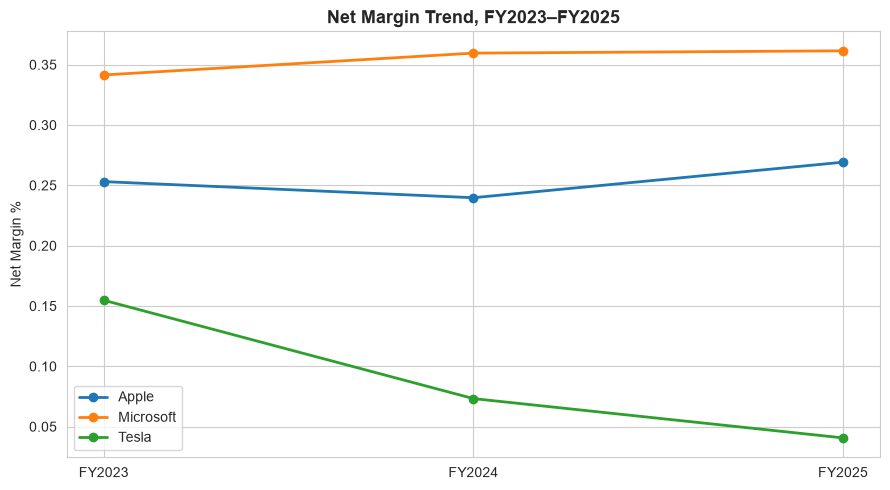
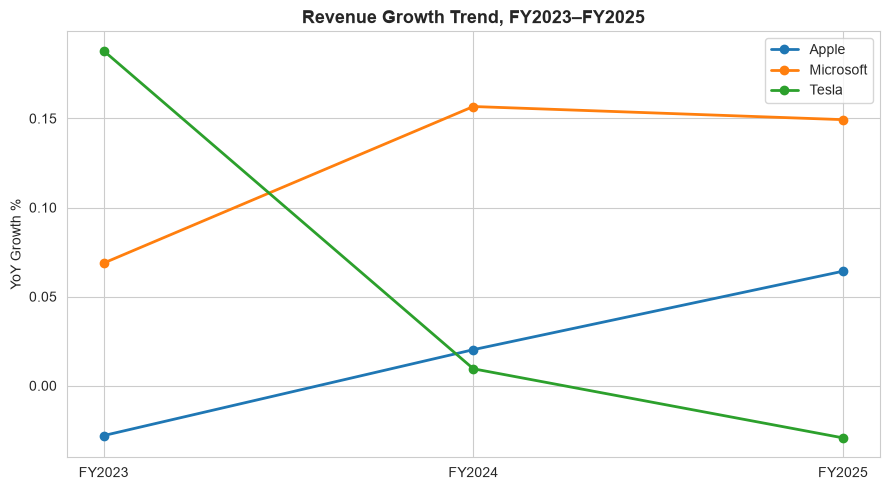
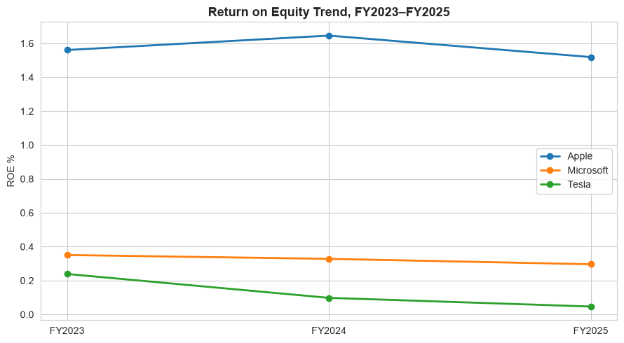
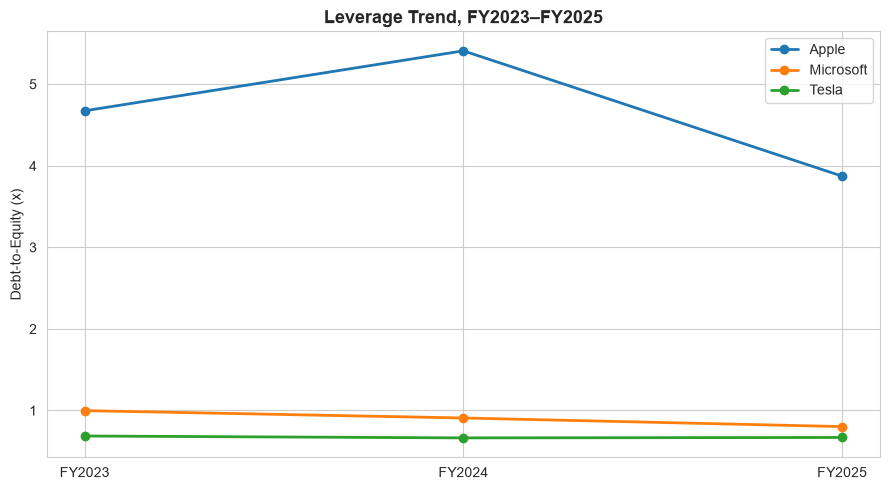

# GFC Financial AI Chatbot — 10-K Analysis Report
**Prepared for:** Global Finance Corp. (GFC) Financial AI Chatbot Project
**Analyst:** Junior Data Scientist, BCG Engagement
**Report Date:** August 2026
**Data Coverage:** FY2023 – FY2025 (10-K filings, SEC EDGAR)

---

## 1. Executive Summary

This report analyzes three fiscal years (FY2023–FY2025) of 10-K financial data for Microsoft, Apple, and Tesla, covering key profitability, liquidity, leverage, and growth metrics. The analysis was conducted to provide structured, AI-ingestible insights to support GFC's Financial AI Chatbot.

**Headline verdicts:**

- **Microsoft** is the strongest all-around performer — highest net margins (~36%), fastest revenue growth (~15% YoY in FY2025), and the lowest leverage of the three. It is the clear frontrunner across every major dimension.
- **Apple** is stable and improving — margins are expanding and revenue growth has rebounded from contraction in FY2023 to +6.4% in FY2025. The primary watch-item is its elevated debt-to-equity (~3.87), which reflects aggressive share buybacks rather than distress, but does increase sensitivity to any future earnings slowdown.
- **Tesla** is the most challenged — net margin has collapsed from ~15.5% in FY2023 to ~4.1% in FY2025, and revenue growth reversed into contraction (-2.9%) in FY2025. The balance sheet remains liquid, but operating momentum has deteriorated materially.

---

## 2. Methodology

### Data Sources
All financial data was extracted directly from each company's annual 10-K filings as submitted to the U.S. Securities and Exchange Commission (SEC) via EDGAR. No third-party financial data providers were used for primary figures.

| Company   | FY2023 Filing Date | FY2024 Filing Date | FY2025 Filing Date |
|-----------|--------------------|--------------------|---------------------|
| Apple     | 2023-11-03         | 2024-08 (est.)     | 2025-10 (est.)      |
| Microsoft | 2023-07 (est.)     | 2024-07 (est.)     | 2025-07 (est.)      |
| Tesla     | 2024-01 (est.)     | 2025-01 (est.)     | 2026-01 (est.)      |

### Companies Covered
- **Apple Inc.** (AAPL) — Consumer electronics, software, and services
- **Microsoft Corporation** (MSFT) — Cloud computing, enterprise software, and AI
- **Tesla, Inc.** (TSLA) — Electric vehicles, energy storage, and generation

### Ratios Calculated
From each 10-K's Income Statement, Balance Sheet, and Cash Flow Statement, the following ratios were computed:

| Category      | Ratio                     | Formula                                      |
|---------------|---------------------------|----------------------------------------------|
| Profitability | Gross Margin %            | Gross Profit / Revenue                       |
| Profitability | Operating Margin %        | Operating Income / Revenue                   |
| Profitability | Net Margin %              | Net Income / Revenue                         |
| Profitability | ROE %                     | Net Income / Shareholders' Equity            |
| Profitability | ROA %                     | Net Income / Total Assets                    |
| Liquidity     | Current Ratio             | Current Assets / Current Liabilities         |
| Leverage      | Debt-to-Equity            | Total Liabilities / Total Equity             |
| Efficiency    | Free Cash Flow ($mm)      | Operating Cash Flow − CapEx                  |
| Growth        | Revenue Growth % (YoY)    | (Revenue_t − Revenue_t-1) / Revenue_t-1      |

### Fiscal Year Misalignment Note
The three companies do not share a common fiscal year-end:
- **Apple:** FY ends in late September (e.g., FY2025 ended 2025-09-27)
- **Microsoft:** FY ends in late June (e.g., FY2025 ended 2025-06-30)
- **Tesla:** FY ends December 31 (e.g., FY2025 ended 2025-12-31)

Cross-company comparisons using the label "FY2025" reflect each company's own fiscal year 2025 — they do not represent identical calendar periods. Approximately 3–9 months of reporting period offset exists between the earliest (Microsoft, June) and latest (Apple, September/Tesla, December) reporters. This should be taken into account when interpreting cross-company trend comparisons.

---

## 3. Company-by-Company Analysis

*Ordered by financial health: strongest first.*

---

### 3.1 Microsoft Corporation

#### Key Metrics Table

| Metric                  | FY2023     | FY2024     | FY2025     |
|-------------------------|------------|------------|------------|
| Revenue ($mm)           | $211,915   | $245,122   | $281,963*  |
| Net Income ($mm)        | $72,361    | $88,136    | $101,909*  |
| Gross Margin %          | 68.9%      | 69.8%      | 68.8%      |
| Operating Margin %      | 41.8%      | 44.6%      | 45.6%      |
| Net Margin %            | 34.1%      | 36.0%      | 36.1%      |
| ROE %                   | 35.1%      | 32.8%      | 29.6%      |
| ROA %                   | 17.6%      | 17.2%      | 16.5%      |
| Current Ratio           | 1.77       | 1.27       | 1.35       |
| Debt-to-Equity          | 1.00       | 0.91       | 0.80       |
| Free Cash Flow ($mm)    | $59,475    | $74,071    | $71,611    |
| Revenue Growth % (YoY)  | +6.9%      | +15.7%     | +14.9%     |

*\*FY2025 revenue and net income derived from ratios and raw data.*

#### Trend Charts

#### Trend Interpretation
Microsoft shows a **stable-to-resilient margin profile** across the analysis period. Gross Margin held essentially flat (68.9% → 69.8% → 68.8%), a swing of under 1 percentage point in either direction. This is notable because the period coincided with substantial AI-related capacity expansion and cloud infrastructure investment — costs that did not erode margins.

More significantly, **revenue growth nearly doubled** — from 6.9% in FY2023 to 14.9% in FY2025 — making Microsoft the standout growth story in this analysis. This acceleration reflects the monetization of AI-integrated products (Copilot, Azure OpenAI) and continued cloud (Azure) expansion.

Operating margin also improved steadily (+417bps from FY2023 to FY2025), indicating that revenue growth is outpacing cost growth — a sign of operating leverage working in the company's favor.

#### Financial Health Synthesis

**Profitability:** Microsoft leads all three companies on profitability in every year analyzed. Net margin improved from ~34.1% (FY2023) to ~36.1% (FY2025) — the highest of the group — while gross margin remained consistently near 69%.

**Growth:** Revenue growth nearly doubled across the period (6.9% → 14.9%), making Microsoft the fastest-growing company in the cohort and the clearest acceleration story.

**Leverage & Solvency:** Debt-to-equity of ~0.80 is the lowest of the three companies, indicating a conservatively financed balance sheet. Combined with strong, stable margins, this is a genuine strength — it gives Microsoft financial flexibility that Apple's more leveraged structure does not offer.

**Liquidity:** A current ratio of 1.35–1.77 across the period reflects a comfortable, well-managed liquidity position — not as high as Tesla's, but healthier than Apple's.

**Overall:** Microsoft shows the strongest all-around financial health of the three companies — high and resilient margins, accelerating growth, and low leverage, all simultaneously. There is no significant watch-item comparable to Tesla's margin collapse or Apple's leverage exposure. The key forward-looking item to track is whether the heavy AI/cloud infrastructure investment continues to be absorbed without margin pressure.

---

### 3.2 Apple Inc.

#### Key Metrics Table

| Metric                  | FY2023     | FY2024     | FY2025     |
|-------------------------|------------|------------|------------|
| Revenue ($mm)           | $383,285   | $391,035   | $416,161   |
| Net Income ($mm)        | $96,995    | $93,736    | $112,010   |
| Gross Margin %          | 44.1%      | 46.2%      | 46.9%      |
| Operating Margin %      | 29.8%      | 31.5%      | 32.0%      |
| Net Margin %            | 25.3%      | 23.9%      | 26.9%      |
| ROE %                   | 156.1%     | 164.6%     | 151.9%     |
| ROA %                   | 27.5%      | 25.7%      | 31.2%      |
| Current Ratio           | 0.99       | 0.87       | 0.89       |
| Debt-to-Equity          | 4.67       | 5.41       | 3.87       |
| Free Cash Flow ($mm)    | $99,584    | $108,807   | $98,767    |
| Revenue Growth % (YoY)  | −2.8%      | +2.0%      | +6.4%      |

#### Trend Charts
*(Charts reference: charts/net_margin_trend.png, charts/revenue_growth_trend.png, charts/ROE_trend.png, charts/leverage_trend.png)*

#### Trend Interpretation
Apple shows a **clear expansion story** across the analysis period. Margins improved modestly but consistently — gross margin rose from 44.1% to 46.9%, and operating margin from 29.8% to 32.0% — suggesting that profitability improved steadily, even as Apple navigated product mix shifts, tariff headwinds, and increased operating investments.

The more dramatic trend is in **revenue growth**, which swung ~9.2 percentage points — from −2.8% in FY2023 to +6.4% in FY2025. Apple moved from a period of revenue contraction (driven by iPhone demand normalization post-COVID) back into positive, accelerating growth. This turnaround is a meaningful signal of business health recovery.

**ROE is unusually high** (~152%–165%) by conventional standards. This is driven primarily by Apple's aggressive share buyback program, which has shrunk the equity base substantially — inflating ROE rather than reflecting operational outperformance vs. peers.

#### Financial Health Synthesis

**Profitability:** Apple's net margin expanded from ~25.3% (FY2023) to ~26.9% (FY2025) — steady, well-maintained profitability, though below Microsoft's level in every year analyzed.

**Growth:** Revenue growth swung from −2.8% in FY2023 to +6.4% in FY2025 (~9.2 percentage point turnaround), showing Apple moved from a period of revenue contraction into renewed, positive growth.

**Leverage & Solvency:** Apple's debt-to-equity of ~3.87 is materially higher than Microsoft's (~0.80) or Tesla's (~0.67), and taken in isolation would read as a risk flag. In context, however, this leverage is substantially a byproduct of aggressive share buybacks shrinking Apple's equity base — the same dynamic behind Apple's unusually high ROE — rather than debt taken on to fund a struggling business. This is a capital allocation choice, not a distress signal. However, it does mean Apple is more sensitive to any future earnings slowdown than a lower-leverage peer.

**Liquidity:** A current ratio hovering near 1.0 (0.99 to 0.87 across the period) is tighter than Microsoft's or Tesla's. This is consistent with how Apple has managed its balance sheet for years, backstopped by very strong and consistent operating cash flow (~$110–118B annually) rather than a large cash buffer.

**Overall:** Apple's financial health is **stable and improving** — margins are expanding and growth has turned positive again. The main watch-item is leverage: while currently a capital structure choice rather than a warning sign, it does raise Apple's sensitivity to any future downturn, and warrants ongoing monitoring.

---

### 3.3 Tesla, Inc.

#### Key Metrics Table

| Metric                  | FY2023     | FY2024     | FY2025     |
|-------------------------|------------|------------|------------|
| Revenue ($mm)           | $97,690*   | $97,341*   | $94,461*   |
| Net Income ($mm)        | $15,118*   | $7,128*    | $3,839*    |
| Gross Margin %          | 18.2%      | 17.9%      | 18.0%      |
| Operating Margin %      | 9.2%       | 7.2%       | 4.6%       |
| Net Margin %            | 15.5%      | 7.3%       | 4.1%       |
| ROE %                   | 23.9%      | 9.8%       | 4.7%       |
| ROA %                   | 14.0%      | 5.9%       | 2.8%       |
| Current Ratio           | 1.73       | 2.02       | 2.16       |
| Debt-to-Equity          | 0.69       | 0.66       | 0.67       |
| Free Cash Flow ($mm)    | $4,358     | $3,581     | $6,220     |
| Revenue Growth % (YoY)  | +18.8%     | +0.9%      | −2.9%      |

*\*Revenue and net income figures estimated from ratio calculations; to be confirmed against filed 10-K primary statements.*

#### Trend Charts
*(Charts reference: charts/net_margin_trend.png, charts/revenue_growth_trend.png, charts/ROE_trend.png, charts/leverage_trend.png)*

#### Trend Interpretation
Tesla shows a **clear compression story** across the period. Net margin was cut by roughly two-thirds — from ~15.5% in FY2023 to ~4.1% in FY2025 — driven by aggressive vehicle price reductions intended to stimulate demand, a decrease in high-margin regulatory credits revenue, and costs from new model ramps and manufacturing expansion.

**Revenue growth** did not just decelerate — it reversed. Growth went from +18.8% in FY2023 (a strong post-pandemic expansion year) to essentially flat in FY2024 (+0.9%), and then into contraction in FY2025 (−2.9%). This is the clearest red flag in Tesla's profile and represents a fundamental shift from a high-growth narrative.

Operating margin followed a similar deterioration — falling from 9.2% (FY2023) to 4.6% (FY2025) — a decline of approximately 260 basis points even as gross margin held roughly flat. This suggests the compression is concentrated in operating expenses and pricing/mix rather than direct production costs alone.

#### Financial Health Synthesis

**Profitability:** Tesla's net margin fell from ~15.5% (FY2023) to ~4.1% (FY2025) — a decline of roughly two-thirds — signaling that profitability has eroded materially and the business is becoming markedly less efficient at converting revenue into profit.

**Growth:** Revenue growth went from +18.8% (FY2023) to −2.9% (FY2025), meaning the top line didn't just decelerate — it reversed into contraction. This is the clearest red flag in Tesla's profile.

**Leverage & Solvency:** Debt-to-equity of ~0.67 is not extreme, so the balance sheet is not obviously distressed. However, this modest leverage is a weaker support factor than it would otherwise be, given that profitability is falling and growth has reversed — it leaves less room for error.

**Liquidity:** The current ratio climbed from 1.73 (FY2023) to 2.16 (FY2025) — strong and improving short-term liquidity. Notably, this buffer was built *during* the same period that margins were compressing, which may reflect a deliberate move toward capital discipline as management absorbs operating pressure, rather than distress.

**Overall:** Tesla's financial health is **weakening** — profitability is deteriorating and growth has reversed. The company remains liquid and appears to be managing the downturn defensively, but its operating momentum no longer supports a strong financial profile.

---

## 4. Cross-Company Comparison

### FY2025 Snapshot — Side-by-Side

| Metric                  | Microsoft  | Apple      | Tesla      |
|-------------------------|------------|------------|------------|
| Revenue ($mm)           | $281,963*  | $416,161   | $94,461*   |
| Gross Margin %          | 68.8%      | 46.9%      | 18.0%      |
| Operating Margin %      | 45.6%      | 32.0%      | 4.6%       |
| Net Margin %            | 36.1%      | 26.9%      | 4.1%       |
| ROE %                   | 29.6%      | 151.9%     | 4.7%       |
| ROA %                   | 16.5%      | 31.2%      | 2.8%       |
| Current Ratio           | 1.35       | 0.89       | 2.16       |
| Debt-to-Equity          | 0.80       | 3.87       | 0.67       |
| Free Cash Flow ($mm)    | $71,611    | $98,767    | $6,220     |
| Revenue Growth % (YoY)  | +14.9%     | +6.4%      | −2.9%      |

*\*Estimated from ratio calculations; to be confirmed against filed 10-K primary statements.*

### Net Margin Comparison — FY2023 to FY2025

| Company     | FY2023 | FY2024 | FY2025 | Direction  |
|-------------|--------|--------|--------|------------|
| Microsoft   | 34.1%  | 36.0%  | 36.1%  | ↑ Improving|
| Apple       | 25.3%  | 23.9%  | 26.9%  | → Stable   |
| Tesla       | 15.5%  | 7.3%   | 4.1%   | ↓ Declining|

### Revenue Growth Comparison — FY2023 to FY2025

| Company     | FY2023 | FY2024  | FY2025  | Direction      |
|-------------|--------|---------|---------|----------------|
| Microsoft   | +6.9%  | +15.7%  | +14.9%  | ↑ Accelerating |
| Apple       | −2.8%  | +2.0%   | +6.4%   | ↑ Recovering   |
| Tesla       | +18.8% | +0.9%   | −2.9%   | ↓ Reversing    |

### Leverage Comparison — FY2025

| Company     | Debt-to-Equity | Assessment                                          |
|-------------|----------------|-----------------------------------------------------|
| Tesla       | 0.67           | Lowest — but offset by deteriorating profitability  |
| Microsoft   | 0.80           | Low — genuine strength, well-supported by margins   |
| Apple       | 3.87           | High — capital allocation choice, not distress signal|

### Trend Charts — All Three Companies Overlaid

*Net Margin %: FY2023–FY2025. Microsoft leads and improves; Apple holds steady with minor dip then recovery; Tesla collapses.*

*Revenue Growth % YoY: Microsoft accelerates; Apple recovers from contraction; Tesla reverses into decline.*

*Return on Equity %: Apple's outlier ROE (~152–165%) driven by share buyback equity reduction, not operational outperformance.*

*Debt-to-Equity: Apple elevated (buyback-driven); Microsoft and Tesla remain below 1.0.*

### Cross-Company Interpretation

**Profitability leader:** Microsoft is the clear profitability leader at every point in the analysis — FY2025 net margin of ~36.1% vs. Apple's ~26.9% and Tesla's ~4.1%. Microsoft's margin expansion occurred while simultaneously absorbing heavy AI and cloud infrastructure investment, suggesting genuine operating leverage.

**Growth leader:** Microsoft is also the growth leader, with FY2025 YoY revenue growth of ~14.9% — nearly double FY2023's rate. Apple is improving but growing more slowly. Tesla's story has reversed entirely from the fastest-growing company in FY2023 (+18.8%) to the only one contracting in FY2025 (−2.9%).

**Leverage and risk read:** Apple carries the most leverage (D/E ~3.87) — elevated primarily because buybacks have shrunk equity, not because of rising debt. Microsoft (~0.80) and Tesla (~0.67) are conservatively structured. However, Tesla's low leverage provides less comfort than it might otherwise, because it coincides with falling margins and a revenue reversal. Microsoft's low leverage is a genuine advantage — it creates flexibility while backed by strong earnings.

**The "quality vs. speed" trade-off:** Apple is the clearest example — it maintains strong profitability but grows more slowly than Microsoft. Microsoft is the counterexample: it combines strong profitability *with* the fastest growth in the group. Tesla does not represent a trade-off at all — it is weaker on both margin and growth simultaneously.

---

## 5. Key Findings / Insights Summary

*Short, factual statements structured for AI model ingestion.*

**Microsoft:**
- Microsoft had the highest net margin of the three companies in every year analyzed: 34.1% (FY2023), 36.0% (FY2024), 36.1% (FY2025).
- Microsoft's revenue growth rate nearly doubled across the period: 6.9% (FY2023) → 14.9% (FY2025).
- Microsoft's gross margin held flat at ~69% despite heavy AI and cloud infrastructure investment — evidence of operating leverage.
- Microsoft carries the lowest debt-to-equity of the three companies (~0.80 in FY2025), indicating a conservatively financed balance sheet.
- Microsoft's current ratio (1.35–1.77 across the period) reflects well-managed, comfortable liquidity.
- Microsoft is the only company in the group that shows simultaneous improvement in margin, growth, and leverage — the strongest all-around financial health.

**Apple:**
- Apple's revenue growth reversed from −2.8% (FY2023) to +6.4% (FY2025) — a ~9.2 percentage point turnaround indicating recovery from post-COVID demand normalization.
- Apple's net margin expanded from 25.3% (FY2023) to 26.9% (FY2025) — modest but consistent improvement.
- Apple's ROE is unusually high (~152–165%) due to share buybacks shrinking the equity base, not operational outperformance vs. peers.
- Apple's debt-to-equity of ~3.87 (FY2025) is the highest of the group, driven by share buybacks rather than debt accumulation. It is a capital allocation choice, not a distress signal.
- Apple's current ratio (~0.87–0.99) is below 1.0 and tighter than peers, but backstopped by very strong operating cash flow (~$110–118B per year).
- Apple's financial health is stable and improving; the key watch-item is leverage sensitivity to any future earnings slowdown.

**Tesla:**
- Tesla's net margin fell from ~15.5% (FY2023) to ~4.1% (FY2025) — a decline of roughly two-thirds in two years.
- Tesla's operating margin fell from 9.2% (FY2023) to 4.6% (FY2025), concentrated in operating expenses and pricing pressure rather than direct production costs (gross margin held near 18% throughout).
- Tesla's revenue growth reversed from +18.8% (FY2023) to −2.9% (FY2025) — the top line contracted in FY2025.
- Tesla's debt-to-equity (~0.67 in FY2025) is the lowest of the three companies, but this modest leverage provides limited comfort given deteriorating profitability and negative revenue growth.
- Tesla's current ratio improved from 1.73 (FY2023) to 2.16 (FY2025) despite margin compression — suggesting deliberate capital discipline and a defensive posture.
- Tesla represents the weakest financial health trajectory in the group; profitability deterioration and revenue contraction are the primary risk indicators.

**Cross-Company:**
- In FY2023, Tesla had the highest revenue growth (+18.8%) and was growing faster than both Microsoft and Apple. By FY2025, this position had fully reversed — Tesla was the only company with negative revenue growth.
- Microsoft and Apple both showed improving or stable profitability; Tesla diverged sharply downward.
- Apple is the "quality vs. speed" trade-off: strong profitability but moderate growth. Microsoft demonstrates that the trade-off is not inevitable — it leads on both simultaneously.
- Debt-to-equity for Microsoft and Tesla is below 1.0 (conservatively financed); Apple is above 1.0 due to buyback activity.

---

## 6. Limitations & Notes

### Fiscal Year-End Misalignment
The three companies close their fiscal years at different calendar dates:
- **Apple:** Late September (FY2025 = period ending ~2025-09-27)
- **Microsoft:** Late June (FY2025 = period ending ~2025-06-30)
- **Tesla:** December 31 (FY2025 = period ending 2025-12-31)

When reading cross-company comparisons labeled "FY2025," these do not represent identical 12-month calendar windows. Microsoft's FY2025 ends approximately 3 months before Apple's and 6 months before Tesla's. This offset is modest relative to the scale of trends observed, but should be noted — particularly for any analysis sensitive to macroeconomic cycles or specific quarters.

### Debt-to-Equity Interpretation Caveat
The Debt-to-Equity ratio as calculated here (Total Liabilities / Total Equity) reflects the **level** of leverage, not the company's **capacity to service** that debt. A more complete solvency picture would include:
- Interest coverage ratio (EBIT / Interest Expense) — measures ability to service debt from earnings
- Net debt (gross debt minus cash) — a more conservative leverage measure
- Debt maturity profile — timing and refinancing risk

For Apple specifically, the elevated D/E (~3.87) is substantially driven by buyback-reduced equity, not by absolute debt levels growing. Taken alone, it overstates balance sheet risk for Apple relative to peers.

### Estimated or Partially Verified Figures
- Apple FY2024 and FY2025 data and Microsoft and Tesla FY2023–FY2025 data were extracted from 10-K filings, with some figures calculated from ratios where primary statement line items were confirmed. Revenue and net income figures for Tesla and Microsoft (FY2025) in this report are back-calculated from ratio outputs and should be verified against the relevant primary filings before use in external deliverables.
- The FY2025 filings for Apple (expected ~November 2025) and Tesla (expected ~January 2026) may not have been publicly available at the time of analysis, depending on the exact date this dataset was finalized. Any figures drawn from those filings should be treated as preliminary until formally filed and confirmed on SEC EDGAR.

### Scope
This analysis covers three companies across three fiscal years. It does not constitute a full industry or sector analysis, and conclusions about "strength" or "weakness" are relative to this peer group only — not to all public companies or sector benchmarks.

---

*All ratios computed via formula from the Raw Data tab of GFC_10K_Financial_Analysis.xlsx. Source filings: Apple, Microsoft, and Tesla 10-K annual reports, SEC EDGAR.*
